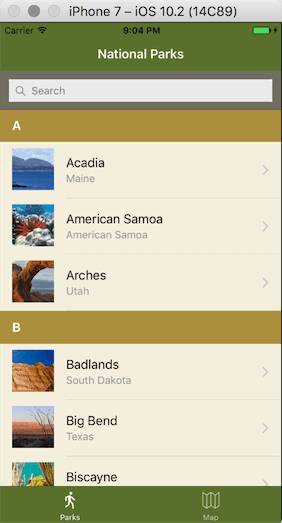

Tab-based app
===




Start new project
```bash
ionic start Ionic2Parks https://github.com/chrisgriffith/Ionic2Parks --v2
```

ionic g page parkDetails

自定义的CustomMapMarker完全是没有必要的, 在for let of中可以直接使用theParker作为navParam.

```js
google.maps.event.addListener(parkMarker, 'click', () => {
  this.navCtrl.push(ParkDetailsPage, {
    parkData: thePark
  });
})
```
